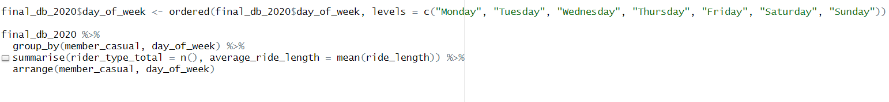
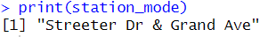
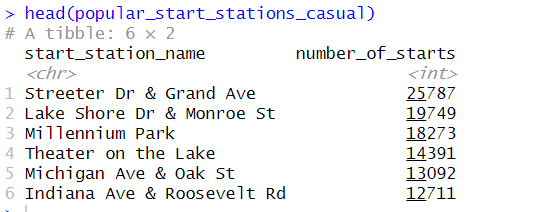
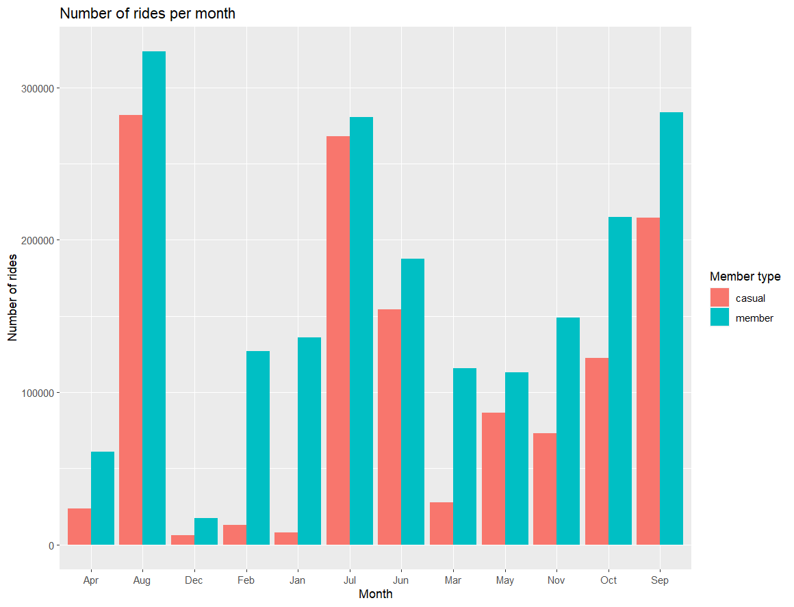

# CASE STUDY: Chicago Cyclist Bike-Share Analysis

##### Author: Dhevenddra
##### Date: January 25, 2023

##### [Tabealu Dashboard](https://public.tableau.com/shared/GSNKFWTGZ?:display_count=n&:origin=viz_share_link)

#

_The case study follows the six step data analysis process:_

###  ❓ [Ask](#1-ask)
### 💻 [Prepare](#2-prepare)
### 🛠  [Process](#3-process)
### 📊 [Analyze](#4-analyze)
### 📋 [Share](#5-share)
### 🚲 [Act](#6-act)

## Scenario
Cyclistic launched a successful bike-share offering. The company’s future success depends on maximizing the number of annual memberships. Therefore, your team wants to understand how casual riders and annual members use Cyclistic bikes differently. From these insights, your team will design a new marketing strategy to convert casual riders into annual members.

## About the company
In 2016, Cyclistic launched a successful bike-share offering. Since then, the program has grown to a fleet of 5,824 bicycles that are geotracked and locked into a network of 692 stations across Chicago. The bikes can be unlocked from one station and returned to any other station in the system anytime. Until now, Cyclistic’s marketing strategy relied on building general awareness and appealing to broad consumer segments. One approach that helped make these things possible was the flexibility of its pricing plans: single-ride passes, full-day passes, and annual memberships. Customers who purchase single-ride or full-day passes are referred to as casual riders. Customers who purchase annual memberships are Cyclistic members. Cyclistic’s finance analysts have concluded that annual members are much more profitable than casual riders. Although the pricing flexibility helps Cyclistic attract more customers, Moreno believes that maximizing the number of annual members will be key to future growth. Rather than creating a marketing campaign that targets all-new customers, Moreno believes there is a very good chance to convert casual riders into members. She notes that casual riders are already aware of the Cyclistic program and have chosen Cyclistic for their mobility needs. Moreno has set a clear goal: Design marketing strategies aimed at converting casual riders into annual members. In order to do that, however, the marketing analyst team needs to better understand how annual members and casual riders differ, why casual riders would buy a membership, and how digital media could affect their marketing tactics. Moreno and her team are interested in analyzing the Cyclistic historical bike trip data to identify trends

## Characters and teams 
- Cyclistic: A bike-share program that features more than 5,800 bicycles and 600 docking stations. Cyclistic sets itself apart by also offering reclining bikes, hand tricycles, and cargo bikes, making bike-share more inclusive to people with disabilities and riders who can’t use a standard two-wheeled bike. The majority of riders opt for traditional bikes; about 8% of riders use the assistive options. Cyclistic users are more likely to ride for leisure, but about 30% use them to commute to work each day.
- Lily Moreno: The director of marketing and your manager. Moreno is responsible for the development of campaigns and initiatives to promote the bike-share program. These may include email, social media, and other channels.
- Cyclistic marketing analytics team: A team of data analysts who are responsible for collecting, analyzing, and reporting data that helps guide Cyclistic marketing strategy. You joined this team six months ago and have been busy learning about Cyclistic’s mission and business goals — as well as how you, as a junior data analyst, can help Cyclistic achieve them.
- Cyclistic executive team: The notoriously detail-oriented executive team will decide whether to approve the recommended marketing program.

## 1. Ask
1. What is the problem you are trying to solve?  
Examine the different types of customers (casual riders, members) and extract useful data that would help in converting casual riders to members.
2. How can your insights drive business decisions?
The insights would help to design a new marketing strategy to convert casual riders into annual members

### Guiding Questions
Three questions will guide the future marketing program: 
1. How do annual members and casual riders use Cyclistic bikes differently? 
2. Why would casual riders buy Cyclistic annual memberships?
3. How can Cyclistic use digital media to influence casual riders to become members?

### Key tasks 
-	Identify the business task 
Design strategies that would help convert casual riders into members
-	Consider key stakeholder
Director of Marketing (Lily Moreno), Marketing Analytics team, Executive team

### Deliverable 
A clear statement of the business task
Determine the difference in usage pattern of annual members and casual riders to define a strategy to increase annual member conversion rate.

## 2. Prepare

### Guiding questions 
1. Where is your data located? 
We will be using Cyclistics historical trip data from here. It is a public dataset provided by Motivate International Inc.
2. How is the data organized? 
Data of 12 months is used of year 2020. Each file consists data of each month. First quarter file consists data of Jan, Feb, Mar. The files are of CSV format.
3. Are there issues with bias or credibility in this data? Does your data ROCCC? 
There are no issues with bias or credibility in this data as it is gathered first hand by the company and the population is its entire client base. My data is reliable, organized, comprehensive, current and cited.
4. How are you addressing licensing, privacy, security, and accessibility? 
The data also does not include any personal information like credit card information.
5. How did you verify the data’s integrity? 
The dataset contains 13 columns and data is up to date and licenced.
6. How does it help you answer your question? 
The data will help to determine the pattern and define the difference in the usage of casual riders and members
7. Are there any problems with the data?
NA and duplicates cells

### Key tasks 
  1. Download data and store it appropriately. 
	2. Identify how it’s organized. 
	3. Sort and filter the data.
	4. Determine the credibility of the data.

### Deliverable 
A description of all data sources used
The first three months were found in a single csv file while the other months were represented in individual csv files.

## 3. Process

### Guiding questions 
1. What tools are you choosing and why? 
In order to handle large amounts of data R studio is used.
2. Have you ensured your data’s integrity? 
Changes made are cross checked and consistency is ensured.
3. What steps have you taken to ensure that your data is clean? 
A check for duplicates, null value, structure of the dataset were performed
4. Have you documented your cleaning process so you can review and share those results?
Yes

We would need to import the csv’s into Rstudio, in which we would use read_csv.

 |  |
| :---------------------: |

Lets check the structure of our datasets

 |  |
| :---------------------: |
 
All 10 datasets should have identical column names & formatting types. We also should be checking if there are any wrongly formatted data types
start-station_id and end_station_id in "Dec2020" is a character whereas integers in rest of the dataset.

 |  |
| :---------------------: |
 
Merge all datasets into one table

 |  |
| :---------------------: | 

Cleaning our column names

 |  |
| :---------------------: |
 
Check the number of rows
 
 |  |
| :---------------------: |

 |  |
| :---------------------: |
 
Examine the structure of Merged dataset

  |  |
| :---------------------: |

  |  |
| :---------------------: |

Add columns

 |  |
| :---------------------: |
 
Remove duplicates and NA

  |  |
| :---------------------: |

 |  |
| :---------------------: |

Add ride length column

 |  |
| :---------------------: |
 
Remove fields where ride length is less than 0
 
 |  |
| :---------------------: |

### Key tasks 
-	Check the data for errors. 
-	Choose your tools. 
-	Transform the data so you can work with it effectively. 
-	Document the cleaning process.

### Deliverable 
Documentation of any cleaning or manipulation of data 
Screenshots provided above depict the cleaning process.

## 4. Analyze
Guiding questions 
1. How should you organize your data to perform analysis on it? 
The data can be visualized in R studio or Tableau. The data can be exported using write_csv() to work with tableau.
2. Has your data been properly formatted?
yes
3. What surprises did you discover in the data? 
4. What trends or relationships did you find in the data?
Casual riders are more active towards weekends than week days 
5. How will these insights help answer your business questions
   
Amount of casual riders vs members

  |  |
| :---------------------: |

 |  |
| :---------------------: |
 
Calculate min, max, median, standard deviation of ride_length

  |  |
| :---------------------: |

  |  |
| :---------------------: |

Average ride_length for users by day_of_week. 

 |  |
| :---------------------: |

 |  |
| :---------------------: |
 
Most popular month

  |  |
| :---------------------: |

  |  |
| :---------------------: |

Most popular Start station

  |  |
| :---------------------: |

 |  |
| :---------------------: |
 
Most popular Start station for members

  |  |
| :---------------------: |

  |  |
| :---------------------: |

Most popular Start station for casual riders

  |  |
| :---------------------: |

 |  |
| :---------------------: |
 
### Key tasks 
-	Aggregate your data so it’s useful and accessible. 
-	Organize and format your data. 
-	Perform calculations. 
-	Identify trends and relationships.

### Deliverable 
A summary of your analysis
-	There were more members than casual riders in the year 2020.
-	Casual riders had a higher average ride length than members
-	Casual riders had the longest ride time being 156450.40 mins 
-	The most popular day for casual riders was Saturday with an average ride length of 49.18 mins.
-	The most popular day for members was Wednesday with an average ride length of 14.73 mins
-	The most popular month was August with 605652 rides with an average ride duration of 29.45 mins.
-	The least popular month was December with 23295 rides with an average ride duration of 17.90 mins.
-	The most popular start station overall was "Streeter Dr & Grand Ave".
-	The most popular start station for members was "Clark St & Elm St" with 19191 trips starting from here.
-	The most popular start station for casual riders was "Streeter Dr & Grand Ave" with 25787 trips starting from here.

## 5. Share

### Guiding questions 
1. Were you able to answer the question of how annual members and casual riders use Cyclistic bikes differently? 
Yes
2. What story does your data tell? 
Casual riders use the service in greater numbers than the annual members 
3. How do your findings relate to your original question?

- How do annual members and casual riders use Cyclistic bikes differently? 
There are a lot of key difference in usage of cyclist service by casual riders and annual members giving a strong conclusion on why to target casual riders
- Why would casual riders buy Cyclistic annual memberships?
As casual riders are the frequent users of the service, an annual membership could save them money
-	How can Cyclistic use digital media to influence casual riders to become members?
Digital media campaign can target casual riders as the target audience and convert them into annual members
4. Who is your audience? What is the best way to communicate with them?
Stakeholders. They can be communicated with data insights and presentation 
5. Can data visualization help you share your findings? 
Yes

Total number of casual riders and annual members

 |  |
| :---------------------: |

Number of rides by casual riders and annual members by week

 |  |
| :---------------------: |
 
Usage duration by week

 |  |
| :---------------------: |

Number of rides by casual riders and annual members by months

 |  |
| :---------------------: |
 
Usage duration by months

 |  |
| :---------------------: |
 
Hourly use of service throughout the week

 |  |
| :---------------------: |

🎨 **[Tableau Presentation on Cyclistic Bike-Sharing Case Study](https://public.tableau.com/shared/GSNKFWTGZ?:display_count=n&:origin=viz_share_link).**
 
## 6. Act

### Guiding questions 
1. What is your final conclusion based on your analysis? 
Casual riders mostly use the service for leisure activities as they travel a lot during weekends while annual members seem to use the service for daily commute
2. How could your team and business apply your insights? 
The marketing team can target casual rider profiles, bring in luring subscription plans, introduce counter productive subscription system such as an increase in casual usage price while decreasing annual pricing system. Introduce cheaper, cost-effective plans during times where there is a dip in usage.
3. What next steps would you or your stakeholders take based on your findings?
Stakeholders can decide if the marketing strategy produced on the results would provide positive results, they can decide if they need to have an strong advertising system in less popular areas .
4. Is there additional data you could use to expand on your findings?
Yes. The data doesn’t specify external conditions such as climate, economic condition of an area and the data is obtained during the time of pandemic which could have resulted in shorter commutes at certain months. There is no information about the persons age or gender or job.

Marketing recommendations to convert casual riders into members:

##### 🚩  Marketing effort on the top 5 most popular stations for the causal riders. It can be a booth, print media on the bike or the locking station area, or social media post on contest starting from the most popular stations. 

##### ⛱  Promotional short term membership offer during the summer months.

##### 🚴‍♂️ Promotional weekend term membership for the weekends.
